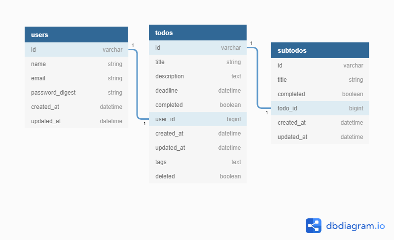

<p align="center"></p>

<h1 align="center">Just To-Do It</h1>

<div align="center">

[](https://app.netlify.com/sites/just-to-do-it-website/deploys)

</div>

<h3 align="center">A todo manager built for CVWO</h3>
<h3 align="center"><a href="https://just-to-do-it-website.netlify.app/">Get Started here!</a></h3>
<h4 align="center">RUPPA NAGARAJAN SIVAYOGA SUBRAMANIAN | A0217379U</h4>
<br/>

## Overview

Just To-Do it is a todo manager that is simple to use and helps you organise your day a little better. With features like tagging, searching and subtodo creation, it helps you plan your day out and organise your tasks so that you can focus on the task at hand.

## App Screenshots on PC:

<p align="center">
  
  &nbsp;&nbsp;&nbsp;&nbsp;
  
</p>
<p align="center">
  
  &nbsp;&nbsp;&nbsp;&nbsp;
  
</p>

## App Screenshots on mobile:

<p align="center">
  
  &nbsp;&nbsp;&nbsp;&nbsp;
  
</p>

## Cloning this repository

```git
git clone --recursive git@github.com:sivayogasubramanian/just-to-do-it.git
```

## Trying out Just To-Di It

If you do not want to go through the hassle of creating an account, you can login into Just To-Do It's official demo account to try the application out

Email: `justtodoit@gmail.com`\
Password: `justtodoit`

## Steps before running this project locally

This project uses .env files for both the frontend and backend modules. It is crucial to set your .env files before you can run locally. To set them up you can follow instructions in the frontend and api submodules repectively

## Submodules

This project has 2 submodules:

1. `just-to-do-it-api` contains code for the backend api which is hosted at [https://just-to-do-it-api.herokuapp.com/](https://just-to-do-it-api.herokuapp.com/)
2. `just-to-do-it-frontend` contains code for the frontend which is hosted at [https://just-to-do-it-website.netlify.app/](https://just-to-do-it-website.netlify.app/)

## Final Submission Folder

The final submission folder contains:

1. [Final-Assignment Report](./final-assignment-submission/final-submission-report.pdf)
2. [Just To-Do It User Guide](./final-assignment-submission/just-to-do-it-user-guide.pdf)
3. [Final DB Schema](./final-assignment-submission/final-db-schema.pdf)

## Final DB Schema

<br/>
<p align="center"></p>

## Mid Submission Folder

The mid submission folder contains:

1. [Mid-Assignment Report](./mid-assignment-submission/mid-submission-report.pdf)
2. [Rails startup screenshot](./mid-assignment-submission/rails-default-startup-screen.png)
